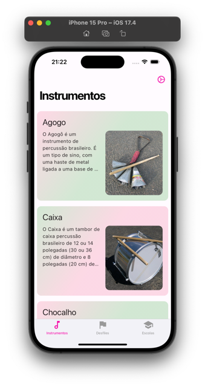
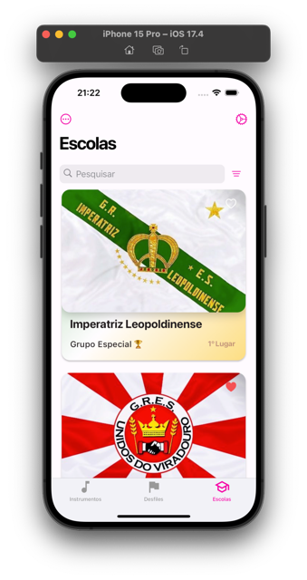
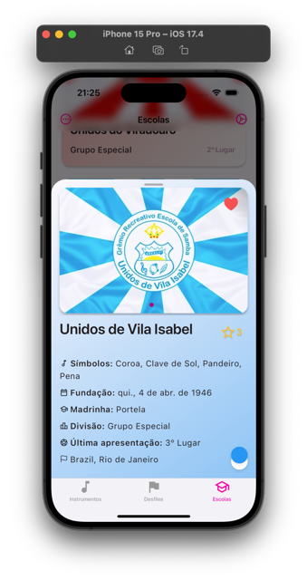

# Samba Sample App

I make a sample app to use good practices in a Flutter project, trying to make a
clean code and a good architecture.

The project uses Riverpod as a state managment. making a good sample to take
code for future projects.

Using an [API](https://github.com/hectorAguero/samba-public-api) created by me
with the data of multiples sites about the Samba Schools in Brazil 🇧🇷

# Photos

| Photo 1                | Photo 2                | Photo 3                |
| ---------------------- | ---------------------- | ---------------------- |
|  |  |  |

# Features

- [x] Cupertino and Material Design adaptive UI
- [x] API Calls with Dio with Natives Client
- [x] Riverpod for State Managment
- [x] Localization with in-app language change
- [x] Navigator 2.0 with GoRouter and StatefulShellBranch
- [x] Linting with very_good_analysis
- [x] Inmutability with DartMappable
- [x] Custom Theme with FlexThemeData and Theme Extensions
- [x] Offload initialization of the main method
- [x] Personalized Widgets with helper extensions
- [x] Pagination and TextSearch to the API
- [x] Make web deploy automatic
- [x] Make design adaptive for material3
- [x] Deploy in Web
- [x] Use Dio Cache

# To do

- [ ] Testing
- [ ] Load Favorites by separate at the start
- [ ] Add Instruments photos
- [ ] Add Instruments learning text

